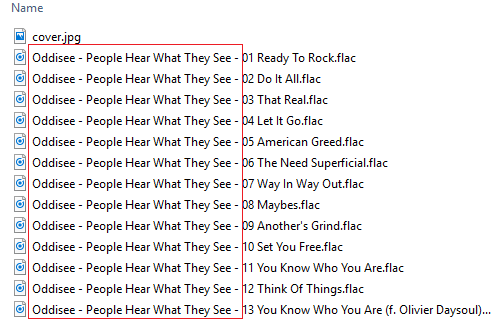

# Audio File Assistant

I made this program for my OCPD self.

## File Renamer

I got sick of the long filenames for everything downloaded from Bandcamp:

This program allows you to bulk edit the filenames by removing the redundant parts inside the directory.

Example:

"Oddisee - People Hear What They See - 01 Ready To Rock.flac" -> "{whatever}01 Ready To Rock.flac"

"Oddisee - People Hear What They See - 02 Do It All.flac" -> "{whatever}02 Do It All.flac"
...

{whatever} can be an empty string or any other text.

I was also annoyed that files downloaded from zdigital / 7digital don't have track numbers in their filenames, so another feature is to bulk add track numbers to filenames.

**2017 Update:** They now include the track numbers!

## Tag Copier

This takes in one source directory and one target directory, and copies the audio tags for all the audio files from the source to target.

Let's say you have MP3 files with correct tags in the source directory, and in the target directory, you have freshly ripped FLAC files of the same album, but the default tags are not entirely correct, you can use this to copy over the tags of the MP3 files to the FLAC files.